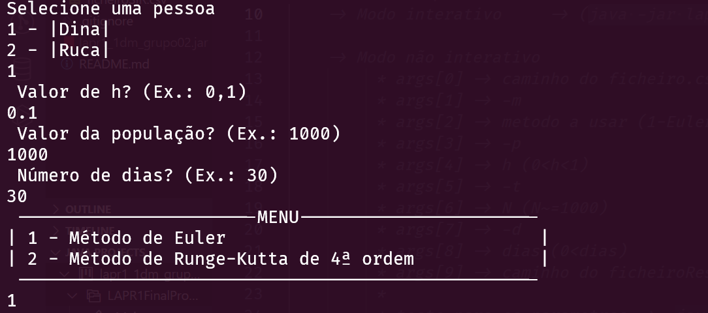
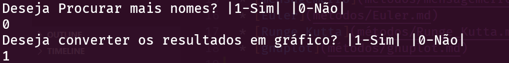

# Modo Interativo

## Descrição ##
-------------------------
-> são feitas questões ao utilizador para que seja possível calcular as diferentes taxas, é também pedido o nome da pessoa que pretende ser analisada.

-> são feitas mais perguntas para saber as configurações relacionadas ao tipo de informação final (gráfico e/ou tabela)
## Métodos usados: ##
-------------------------

* [checkNumberOfLines](métodos/checkNumberOfLines.md)
* [readFile](métodos/readFile.md)
* [mensagemErro](métodos/mensagemErro.md)
* [Euler](métodos/Euler.md)
* [Runge_Kutta](métodos/Runge_Kutta.md)
* [gnuplot](métodos/gnuplot.md)

## Perguntas realizadas ao utilizador ##
-------------------------

## Outras Interações ##
-------------------------
