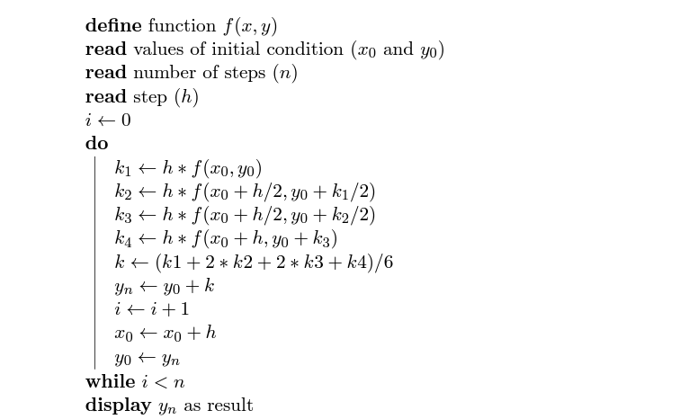

# Runge Kutta

## Descrição ##
-------------------------
-> módulo que aplica o método de Runge-Kutta para os dados desejados e armazena os valores numa matriz.

## Métodos usados: ##
-------------------------
* [printFile](printFile.md)
* [functionS](functionS.md)
* [functionI](functionI.md)
* [functionR](functionR.md)
## Algoritmo: ##
-------------------------

## Código: ##
-------------------------
