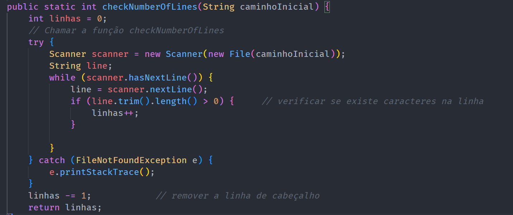

# Check Number of Lines

## Descrição ##
-------------------------
-> módulo que lê o número de linhas no ficheiroInicial.csv e armazena esse número numa variável 
que serve de contador e dá return da mesma para funções que necessitem dela.

## Função: ##
-------------------------
