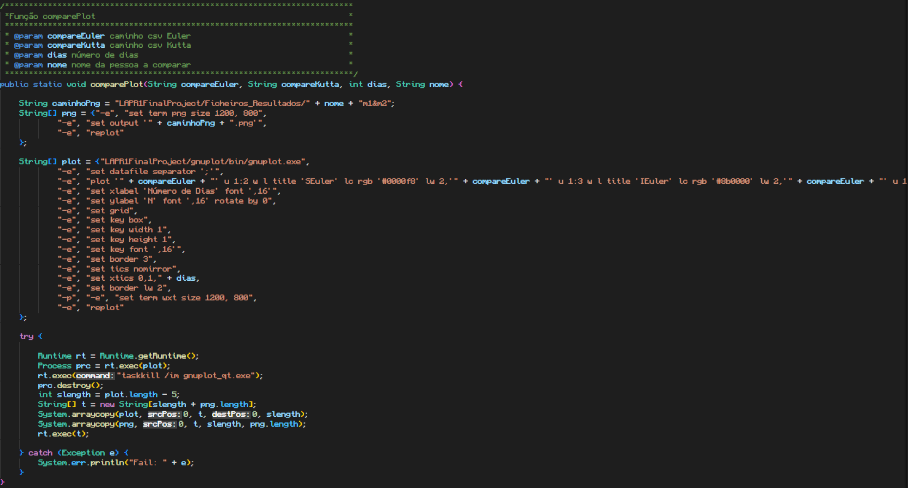

# Compare Plot

## Descrição ##
-------------------------
-> módulo que gera gráficos e guarda-os em formato .png caso exista um ficheiro
 do método de Euler e um ficheiro do método de Runge-Kutta com valores iguais para a mesma pessoa.

## Código: ##
-------------------------
