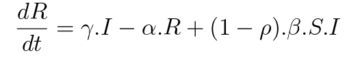

# Function R

## Descrição ##
-------------------------
-> funções que devolve o valore de R para ambos os módulos que executam os métodos numéricos (Euler e Runge_Kutta).

## Função: ##
-------------------------

## Código: ##
-------------------------

