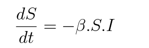
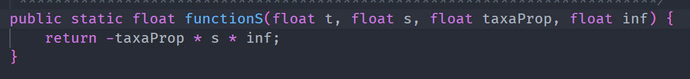

# Function S

## Descrição ##
-------------------------
-> funções que devolve o valore de S para ambos os módulos que executam os métodos numéricos (Euler e Runge_Kutta).

## Função: ##
-------------------------

## Código: ##
-------------------------

