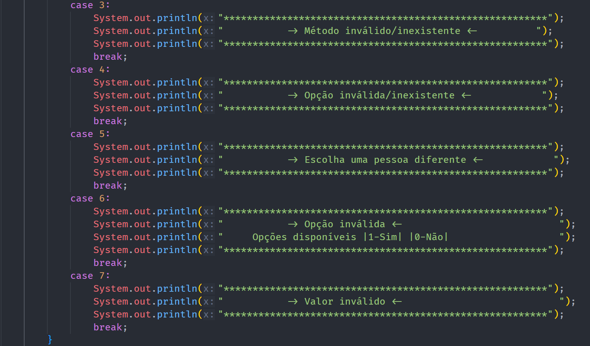

# Mensagem de erro

## Descrição ##
-------------------------
-> módulo que contém todas as mensagens de erro disponíveis para serem chamadas ao longo do código em determinadas validações.

## Prints exemplo: ##
-------------------------
