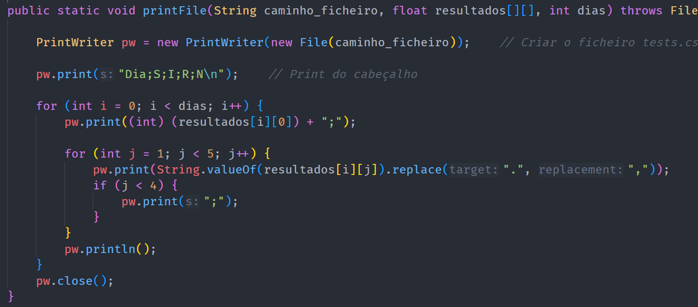

# Print File

## Descrição ##
-------------------------
-> módulo que pega nos valores armazenados na matriz dos valores gerados através dos métodos
numéricos e escreve-os num ficheiro com um nome parecido a "Dinam1p01t1000d30.csv" ou "Dinam2p01t1000d22.csv", dependendo do método 
selecionado e dos valores iniciais inseridos.

## Código: ##
-------------------------
