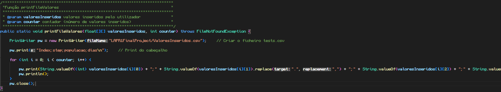

# Print file valores

## Descrição ##
-------------------------
-> módulo que escreve num ficheiro os valores inseridos pelo utilizado com o nome de "ValoresInseridos".

## Código: ##
-------------------------
