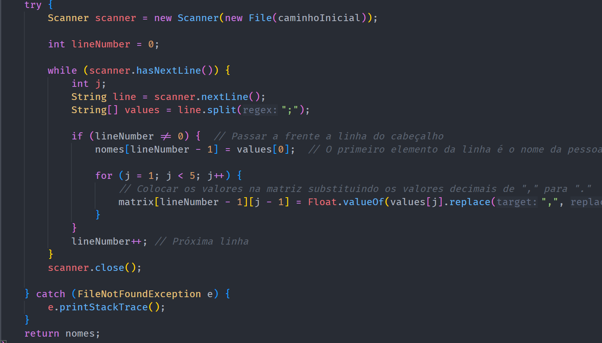

# Read File

## Descrição ##
-------------------------
-> módulo que lê os dados existentes no ficheiroInicial.csv, armazenando os nomes das pessoas num vetor e os dados
correspondentes a cada pessoa numa matriz.

## Função: ##
-------------------------
