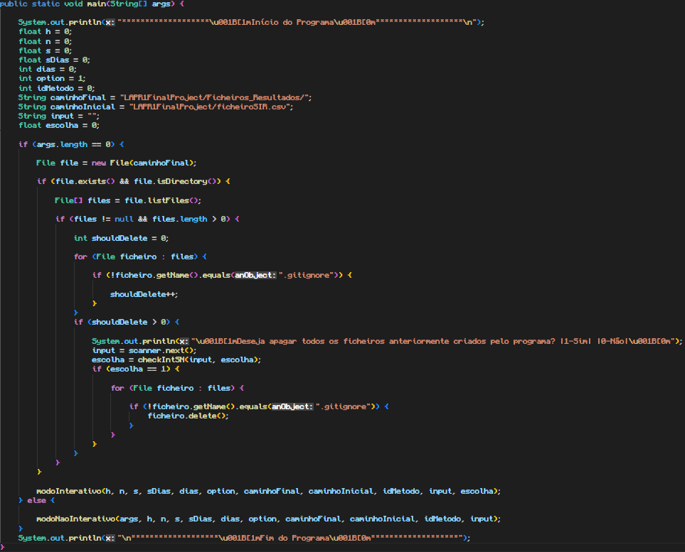

# Função Principal (Main)

## Descrição ##
-------------------------
-> módulo onde são inicializadas variáveis e onde são chamados o modoInterativo e o modoNaoInterativo.
 
->É também neste módulo que, dependendo do modo ativado, o utilizador tem a possibilidade de apagar todos os ficheiros criados anteriormente.

## Métodos usados: ##
-------------------------

* [modo não interativo](modoNaoInterativo.md)
* [modo interativo](modoInterativo.md)

## Código: ##
-------------------------

