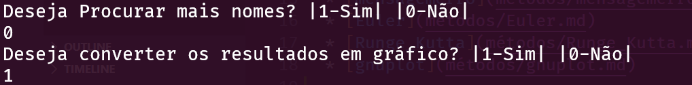

# Modo Interativo

## Descrição ##
-------------------------
-> módulo executado através do comando "java -jar nome_programa.jar" e que consiste na execução do programa através
de menus que permitem ao utilizador definir o que é feito durante o período de execução.

## Métodos usados: ##
-------------------------

* [checkNumberOfLines](métodos/checkNumberOfLines.md)
* [readFile](métodos/readFile.md)
* [mensagemErro](métodos/mensagemerro.md)
* [Euler](métodos/Euler.md)
* [Runge_Kutta](métodos/Runge_Kutta.md)
* [gnuplot](métodos/gnuplot.md)
* [comparePlot](métodos/comparePlot.md)
* [printFileValores](métodos/printFileValores.md)
* [newReadValores](métodos/newReadValores.md)
* [mensagemErrro](métodos/mensagemerro.md)
* [checkIntSN](métodos/checkIntSN.md)
## Perguntas realizadas ao utilizador ##
-------------------------

## Outras Interações ##
-------------------------

