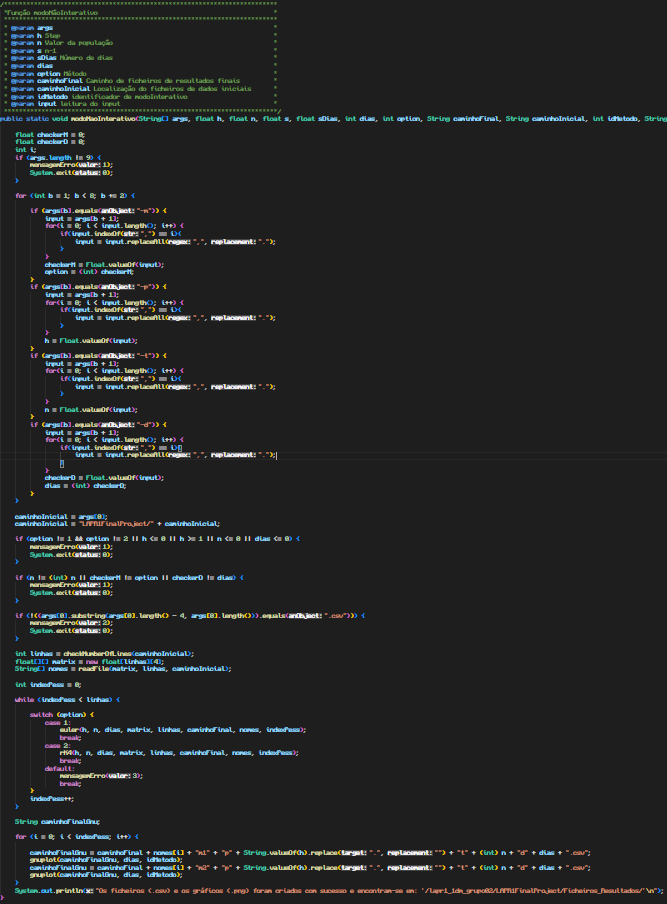

# Modo não interativo

## Descrição ##
-------------------------

-> módulo executado através do comando "java -jar nome_programa.jar ficheiroSIR.csv -m X -p Y -t Z -d K"
e que consiste na execução do programa sem qualquer interação com o utilizador de forma completamente automática, passando os valores 
necessários para os cálculos dos métodos numéricos a partir de parâmetros incluídos no comando escrito anteriormente.
é executado o programa com os parametros dados no comando.

## Métodos usados: ##
-------------------------

* [checkNumberOfLines](métodos/checkNumberOfLines.md)
* [readFile](métodos/readFile.md)
* [Euler](métodos/Euler.md)
* [Runge_kutta](métodos/Runge_Kutta.md)
* [gnuplot](métodos/gnuplot.md)
* [mensagemErro](métodos/mensagemerro.md)

## Código: ##
-------------------------
