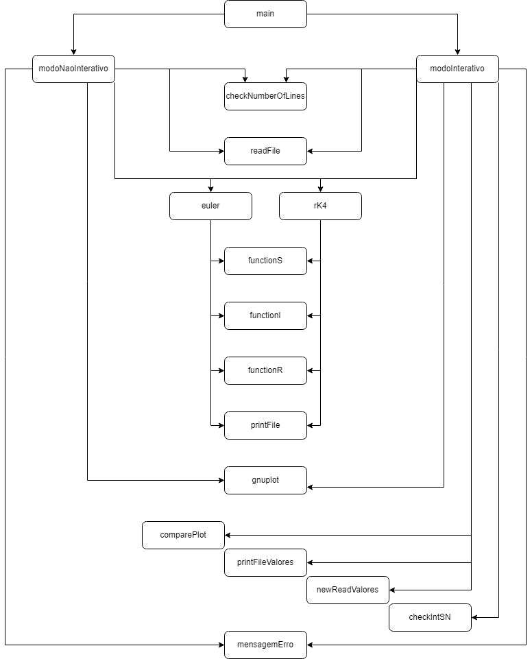

# ISEP-LAPR1-2022/2023

## Introdução ##
------------------
Este repositório contém artefactos didáticos relevantes para o projeto integrador a desenvolver no primeiro semestre do ano letivo 2022-2023 na [Licenciatura em Engenharia (LEI) ](http://www.isep.ipp.pt/Course/Course/26) do [Instituto Superior de Engenharia do Porto (ISEP)](http://www.isep.ipp.pt).

## Modos disponíveis: ##
------------------
* **modo Interativo:**
```
 java -jar lapr1_1dm_grupo02.jar
```

* **modo não interativo:**
```
 java -jar lapr1_1dm_grupo02.jar ficheiroSIR.csv -m 1 -p 0.1 -t 1000 -d 30
```

## Utensílios usados: ##
----------------------

* Usamos o [Trello](https://trello.com/invite/b/aXVvZb4x/ATTIa6ee83f0535319d46e8643906e95abbc11A8D2B8/lapr11dmgrupo02) para o planeamento e organização do projeto, tendo ficado o trabalho de Scrum Master para a aluna Dephane Cabral.
* O Teams e o Bitbucket foram os locais que escolhemos para o armazenamento dos ficheiros
* E por fim, o Discord como meio de comunicação principal

## Tópicos do Projeto: ##
-------------------------
* [Função Principal (main)](Documentos/main.md)
* [modo não interativo](Documentos/modoNaoInterativo.md)
* [modo interativo](Documentos/modoInterativo.md)

## Diagrama do Projeto: ##
-------------------------

## Membros ##
------------------

| Nome               | Números |
|--------------------|---------|
| **João Pinto**     | 1221694 |
| **Rafael Araújo**  | 1201804 |
| **Vasco Sousa**    | 1221700 |
| **Tiago Correia**  | 1211742 |
| **Dephane Cabral** | 1221636 |
